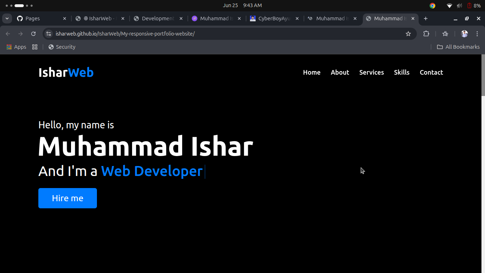
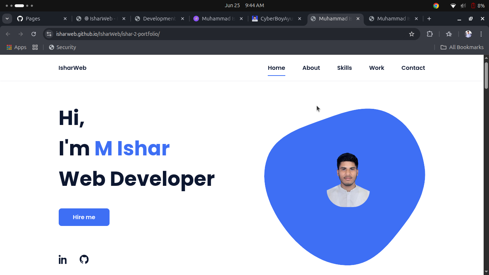
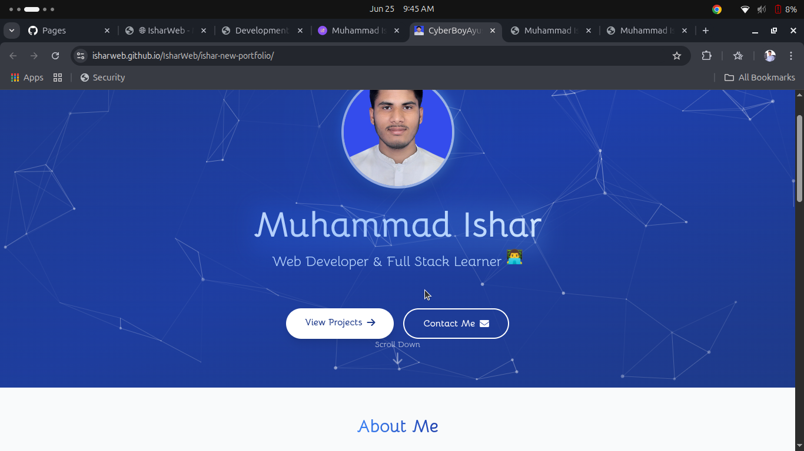
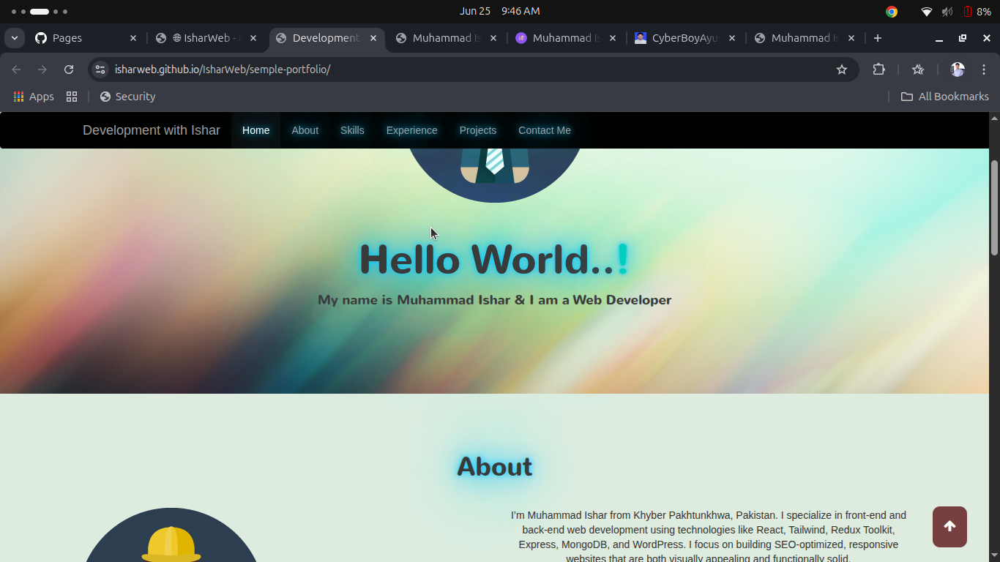
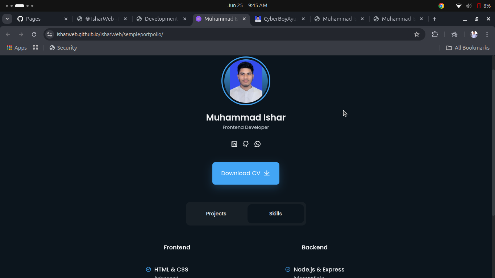

# 🌐 Muhammad Ishar | Web Developer Portfolio

Welcome to my portfolio repository!  
This contains multiple responsive frontend projects built using **HTML**, **CSS**, **JavaScript**, and **React**.

---

## 👨‍💻 About Me

Hi! I'm **Muhammad Ishar**, a passionate **Frontend & Full Stack Web Developer** from **Khyber Pakhtunkhwa, Pakistan**.  
I specialize in crafting **responsive**, **SEO-optimized** websites and bringing creative ideas to life using code.

- 📧 Email: muhammadisharjob@gmail.com  
- 🌐 GitHub: [@IsharWeb](https://github.com/IsharWeb)  
- 📍 Location: Khyber Pakhtunkhwa, Pakistan  

---

## 📂 Live Projects on GitHub Pages:

👉 **Click here to view all my projects live:**  
[https://isharweb.github.io/IsharWeb/](https://isharweb.github.io/IsharWeb/){:target="_blank"}


👉 **Click to View Each Project Live**

1. [Responsive Portfolio Website](https://isharweb.github.io/IsharWeb/My-responsive-portfolio-website/)
2. [Ishar 2 Portfolio](https://isharweb.github.io/IsharWeb/ishar-2-portfolio/)
3. [Ishar New Portfolio](https://isharweb.github.io/IsharWeb/ishar-new-portfolio/)
4. [Semple Portfolio](https://isharweb.github.io/IsharWeb/semple-portfolio/)
5. [Semple Portpolio](https://isharweb.github.io/IsharWeb/sempleportpolio/)

---

## 🖼️ Project Screenshots:

### ✅ 1. Responsive Portfolio Website


---

### ✅ 2. Ishar 2 Portfolio


---

### ✅ 3. Ishar New Portfolio


---

### ✅ 4. Semple Portfolio


---

### ✅ 5. Semple Portpolio


---

## 🚀 Tech Stack:

- HTML5
- CSS3
- JavaScript (ES6+)
- React.js
- Tailwind CSS / Bootstrap
- Node.js / Express / MongoDB
- WordPress
- Git, GitHub, Figma

---

## 📌 Folder Structure:

IsharWeb/
├── My-responsive-portfolio-website/
├── ishar-2-portfolio/
├── ishar-new-portfolio/
├── semple-portfolio/
├── sempleportpolio/
├── images/
└── index.html

yaml
Copy
Edit

---

## ✅ How to Run Locally:

```bash
git clone https://github.com/IsharWeb/IsharWeb.git
cd IsharWeb
Then open any folder and run the index.html in browser.

✅ View Online:
👉 Visit: https://isharweb.github.io/IsharWeb/

📄 License:
This project is open-source and free to use under the MIT License.

Made with ❤️ by Muhammad Ishar
